# Skirk Portal

> A full-stack Genshin Impact team builder and analyzer powered by AI.

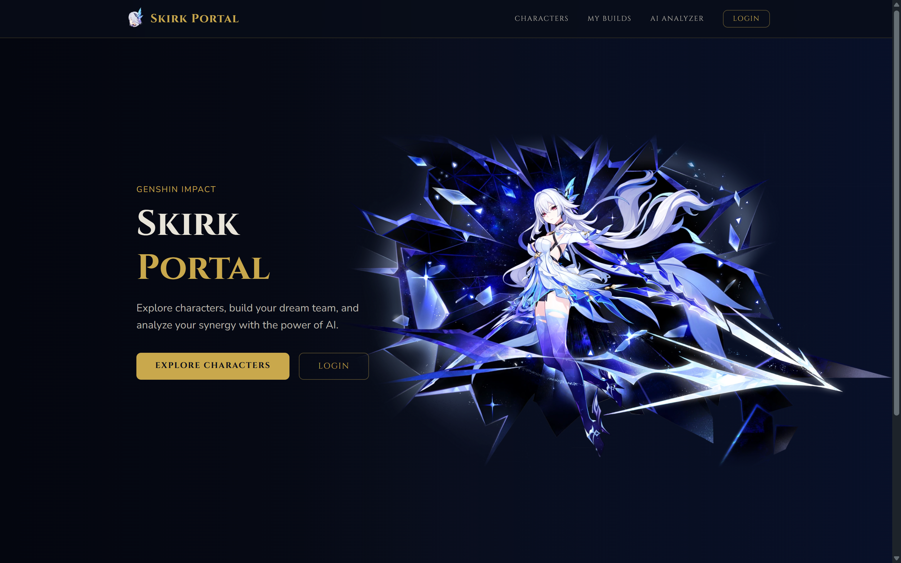

## 🔗 Links

- **Client**: https://skirk-portal-v2.vercel.app/
- **Server**: https://skirk-portal-v2-api.up.railway.app/characters/skirk

---

## 📖 About

Skirk Portal is a full-stack web application themed around Genshin Impact. It allows players to explore characters, create and manage team builds, and analyze team synergy using the power of Gemini AI.

---

## ✨ Features

- 🔍 **Character Explorer** — Browse all Genshin Impact characters with filter by element, weapon, nation, and rarity
- 📋 **Team Builds** — Create, edit, and delete your own team compositions with up to 4 characters
- 🤖 **AI Analyzer** — Analyze your team synergy using Gemini AI — get team name, rating, elemental reactions, strengths, weaknesses, and playstyle
- 🔐 **Authentication** — Register, login, and Google OAuth support
- 📱 **Responsive** — Works on both desktop and mobile

---

## 🛠️ Tech Stack

### Server

- **Runtime**: Node.js
- **Framework**: Express.js
- **Database**: PostgreSQL + Sequelize ORM
- **Auth**: JWT + bcryptjs + Google OAuth
- **AI**: Gemini (`gemini-3-flash-preview`) via `@google/genai`
- **Character Data**: [`genshin-db`](https://www.npmjs.com/package/genshin-db) (local npm package, no external API)
- **Image CDN**: [Enka Network](https://enka.network) (character images served from `enka.network/ui`)
- **Testing**: Jest + Supertest (coverage 95%+)

### Client

- **Library**: React.js (Vite)
- **State Management**: Redux Toolkit
- **Routing**: React Router v7
- **Styling**: Tailwind CSS v4 + DaisyUI v5
- **HTTP**: Axios
- **Auth**: `@react-oauth/google`

---

## 📸 Screenshots

### Homepage


### Characters

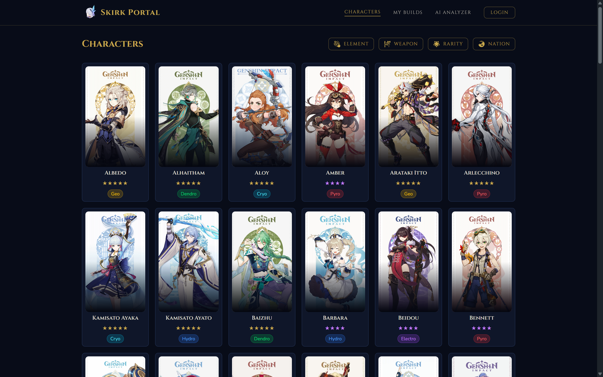

### Character Detail

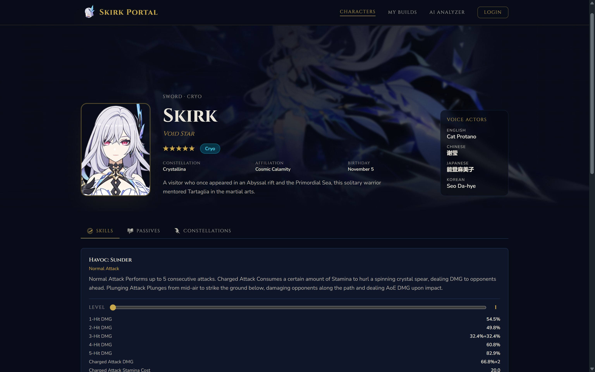

### Login

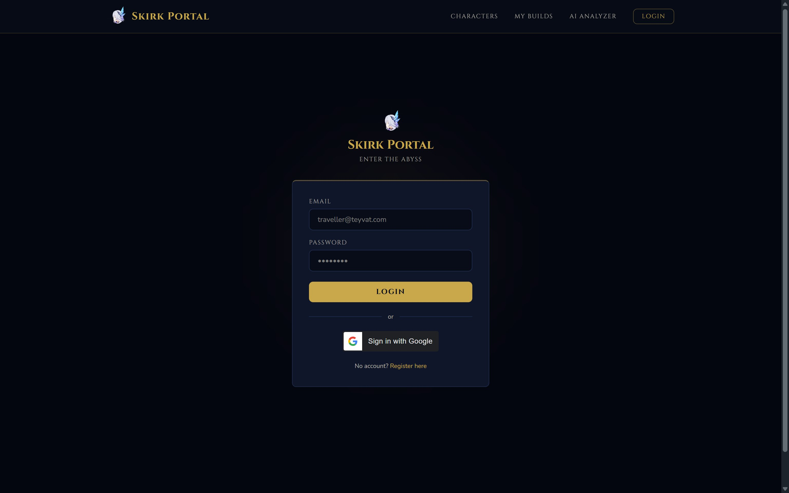

### Register

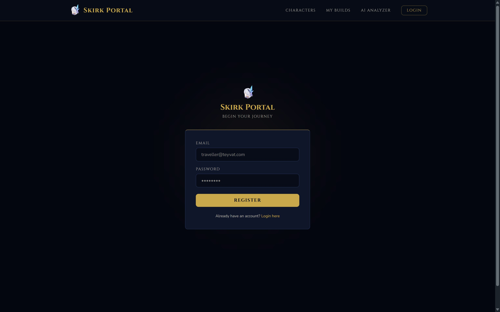

### My Builds

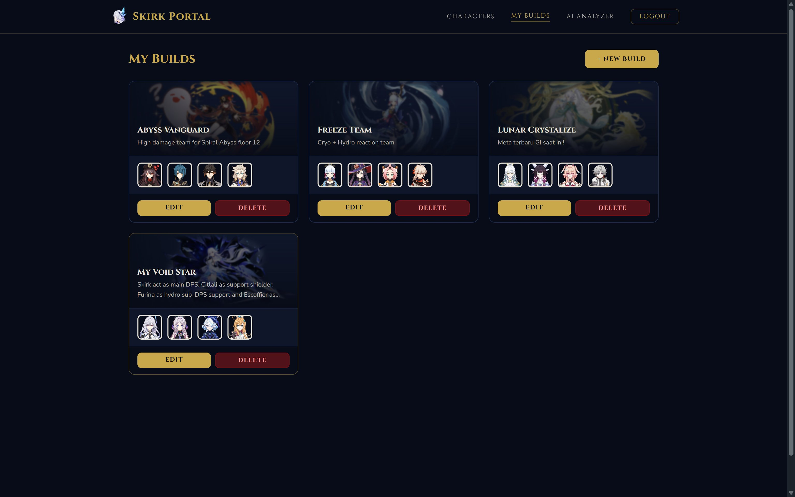

### Create Build

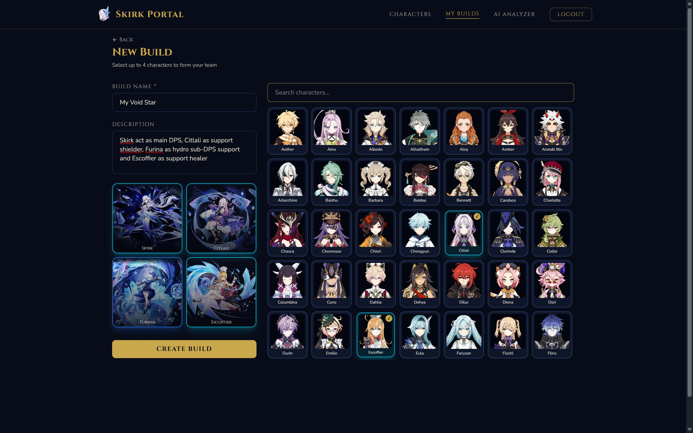

### Edit Build

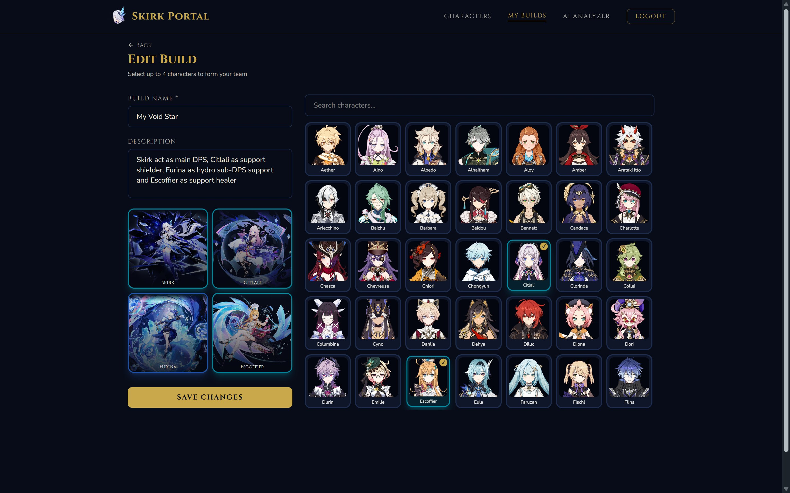

### AI Analyzer

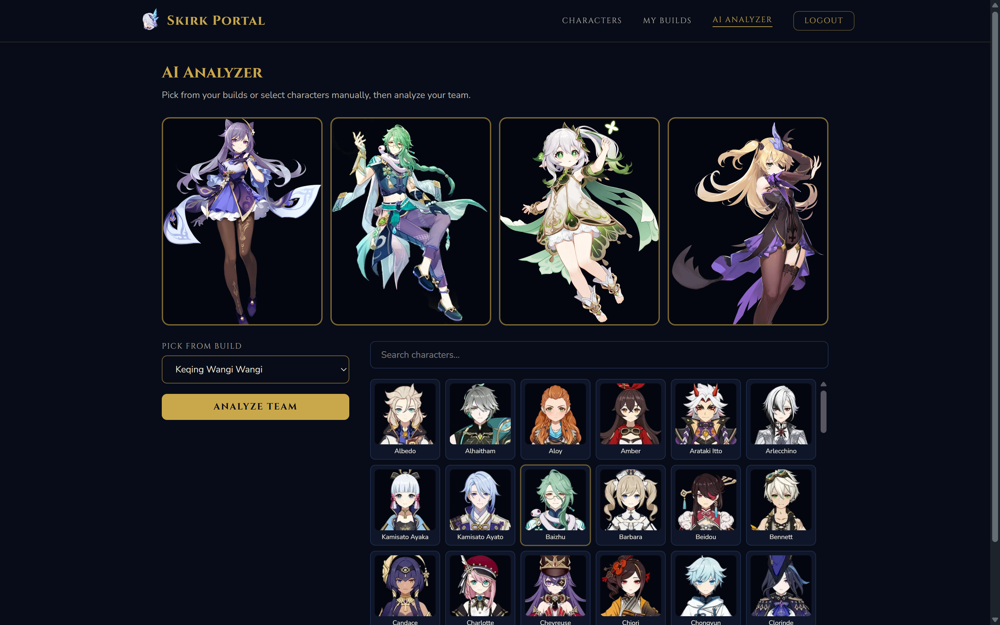

### AI Analyzing

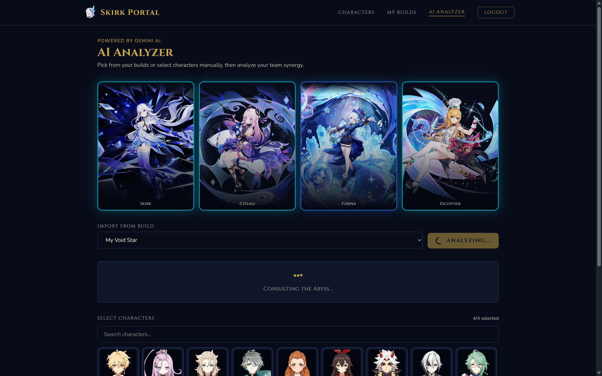

### AI Result

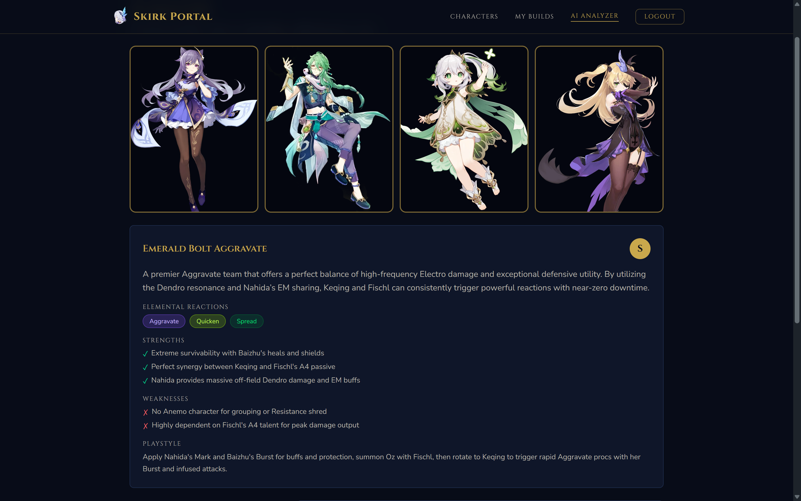

### Mobile View

| Homepage                                                      | Characters                                                      | Login                                                      |
| ------------------------------------------------------------- | --------------------------------------------------------------- | ---------------------------------------------------------- |
| 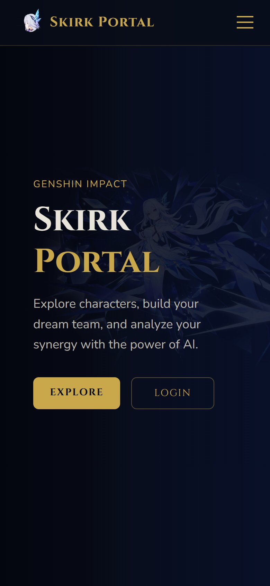 | 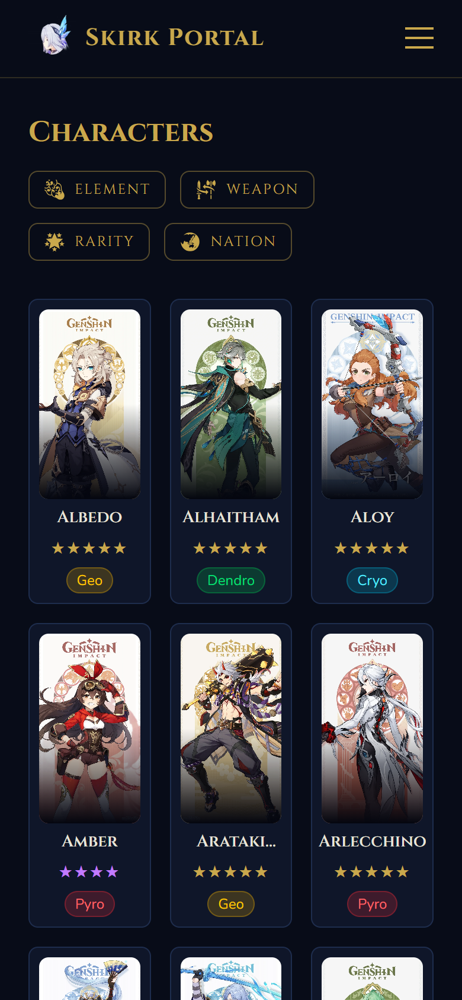 | 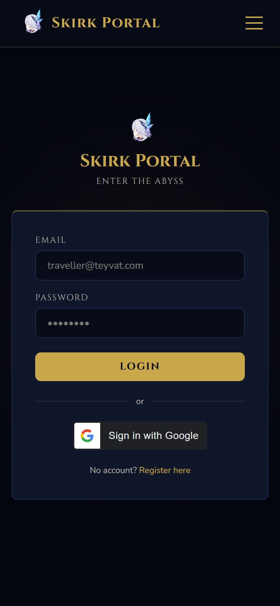 |

---

## 🚀 Getting Started

### Prerequisites

- Node.js
- PostgreSQL

### Server Setup

```bash
cd server
npm install
```

Create `.env` file:

```env
JWT_SECRET_KEY=yoursecretkey
GOOGLE_CLIENT_ID=yourgoogleclientid
GEMINI_API_KEY=yourgeminikey
```

> **Note:** Database is configured via `config/config.json`. Development uses `skirk_portal_v2_dev` with user `postgres`. Production uses the `DATABASE_URL` environment variable.

Run migration and start:

```bash
npx sequelize-cli db:create
npx sequelize-cli db:migrate
npm run dev
```

### Client Setup

```bash
cd client
npm install
```

Create `.env` file:

```env
VITE_API_URL=http://localhost:3000
VITE_GOOGLE_CLIENT_ID=yourgoogleclientid
```

Start:

```bash
npm run dev
```

---

## 🧪 Testing

```bash
cd server

# Run tests
npm test

# Run tests with coverage
npm run test:coverage
```

Coverage: **95%+** across statements, functions, and lines.

---

## 📁 Project Structure

```
ip-AhmadSerafu-skirk-portal/
├── server/
│   ├── __tests__/
│   │   ├── auth.test.js
│   │   ├── build.test.js
│   │   ├── character.test.js
│   │   └── ai.test.js
│   ├── controllers/
│   ├── helpers/
│   ├── middlewares/
│   ├── migrations/
│   ├── models/
│   ├── routers/
│   ├── seeders/
│   ├── app.js
│   └── bin/www
└── client/
    ├── src/
    │   ├── app/
    │   ├── components/
    │   ├── constants/
    │   ├── features/
    │   ├── layouts/
    │   └── views/
    └── index.html
```

---

## 👤 Author

**Ahmad Serafu** — Hacktiv8 Fullstack JavaScript Bootcamp, Phase 2 Individual Project
